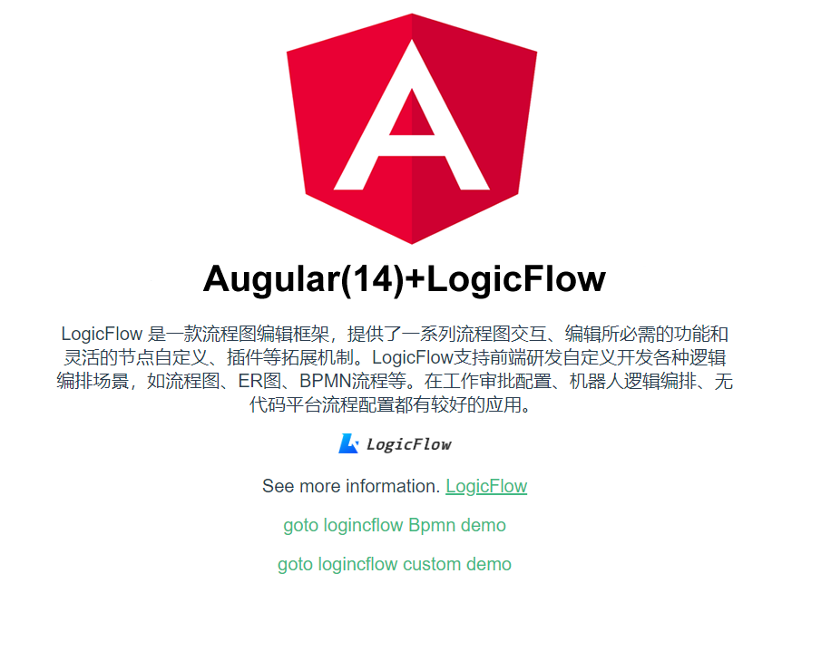
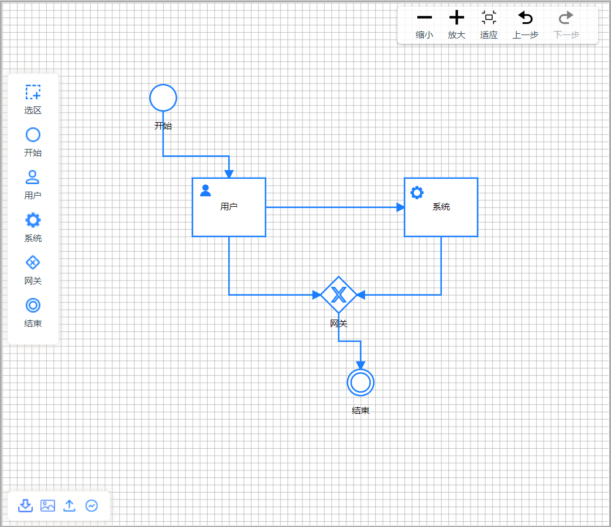
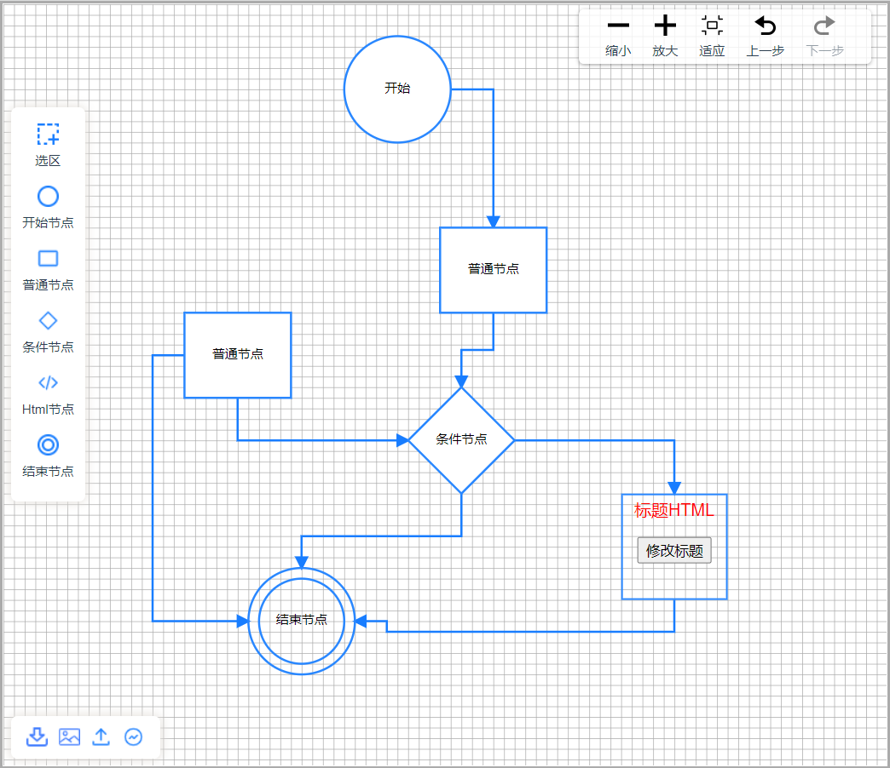
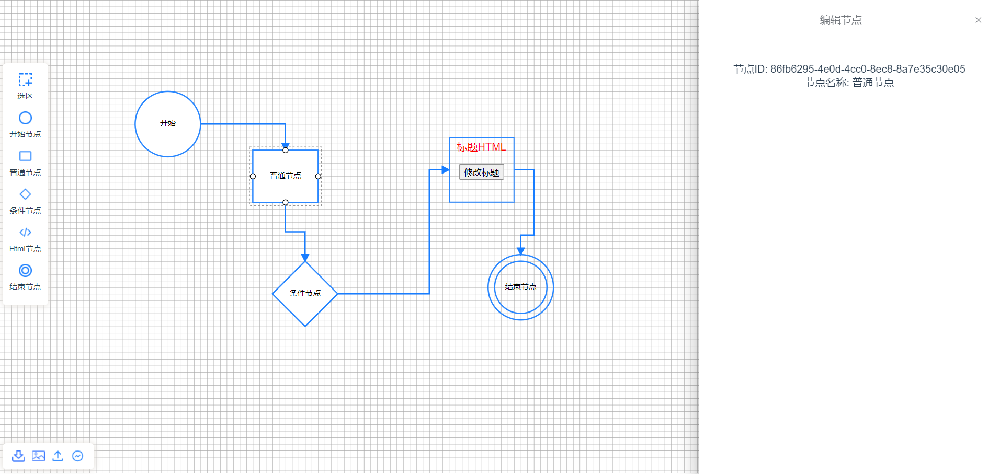

# 项目是Angular版本LogicFlow的入门DEMO实例

## 链接 Angular demo (https://chenweihan.github.io/logicflow-angular/bpmn)
### Angular版本LogicFlow的入门DEMO实例请参考
- 码云 https://gitee.com/copperpeas/logicflow-angular
- github  https://github.com/chenweihan/logicflow-angular
### Vue3版本LogicFlow的入门DEMO实例请参考((Vue2可参考))
- 码云 https://gitee.com/copperpeas/logicflow-vue3
- github  https://github.com/chenweihan/logicflow-vue3

## 项目主要是2个DEMO

* 一个是BPMN流程图

* 一个是自定义流程图

* 点击编辑节点

### 项目运行

#### npm install
#### npm run start

### 项目运行

#### npm install
#### npm run dev

